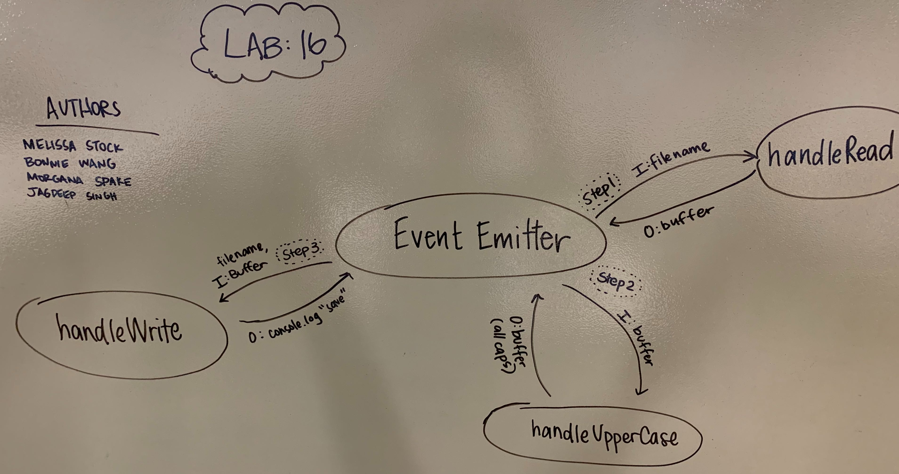

 LAB
=================================================

## Event Driven Applications

### Author: Melissa Stock

### Links and Resources
* [submission PR](https://github.com/401-advancedjs/event-app/pull/1)
* [travis](https://www.travis-ci.com/401-advancedjs/event-app)

#### Documentation
* [jsdoc](https://jsdoc.app/)

### Modules
#### `event-emitter.js`
#### `eventActions.js`
#### `handleRead.js`
#### `handleUpperCase.js`
#### `handleWrite.js`
#### `log.js`
#### `app.js`
#### `test.txt`

##### Exported Values and Methods
###### `event-emitter() -> new event emitter`
###### `event-actions() -> object`

#### Running the app
* `npm start <file name>`
  
#### Tests
* How do you run tests?
    * `npm test`
* What assertions were made?
    * No testing was done
* What assertions need to be / should be made?
    * File Read, File Save, Uppercase
    * Mock the fs module methods
    * Test event handlers (not events themselves)
    * Use spies to help testing your logger methods

#### UML

